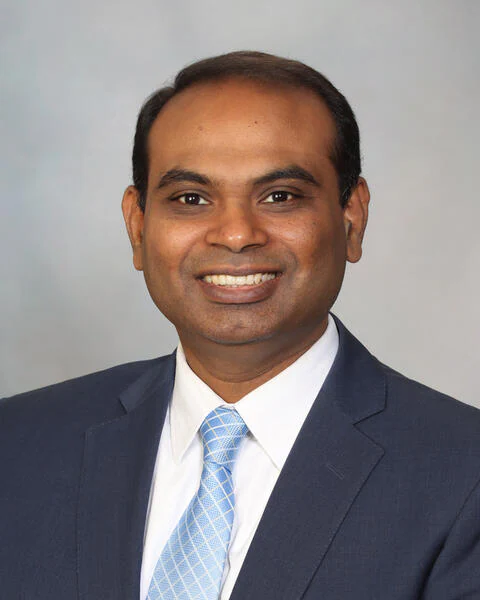

# First Workshop on Clinical Natural Language Processing for Quality of Life (CNLP4QoL)

In conjunction with IEEE ICHI 2026 | Minneapolis, MN, USA | June 1, 2026

Submit on OpenReview(TBD)

---

## 📋 Table of Contents

1. [Overview](#overview)
2. [Call for Papers](#call-for-papers)
3. [Keynote Speakers](#keynote-speakers)
4. [Program Schedule](#program-schedule)
5. [Organizing Committee](#organizing-committee)
6. [Venue & Contact](#venue--contact)

---

## Overview

Quality of Life (QoL) is a multidimensional, patient-centered construct reflecting how health,
functional ability, psychological state, and social context shape an individual’s lived experience and overall well-being. Despite its central role in preventive care, mental health, chronic disease management, and complementary and integrative medicine, QoL remains poorly represented in structured health records. The most meaningful QoL indicators such as functional decline, emotional distress, pain burden, fatigue, sleep disruption, mobility limitations, and social connectedness, are predominantly documented in unstructured clinical narratives, patient-reported outcomes, and patient-generated text. Recent advances in clinical Natural Language Processing (NLP) and large language models (LLMs) offer new opportunities to systematically extract, model, and monitor these signals, enabling earlier detection of deterioration and more patient-centered clinical decision-making.

Despite growing methodological progress, significant challenges limit the reliable and scalable use of NLP for QoL assessment. QoL signals are not single, well-defined clinical entities; they are often implicitly expressed and require contextual interpretation of severity, duration, and temporal change rather than simple presence or absence. Furthermore, there is a lack of standardized conceptual models, annotation guidelines, evaluation metrics, and governance frameworks for QoL-focused NLP systems, hindering reproducibility, comparability, and clinical trust. These gaps impede translation into real-world workflows, even though poor QoL is strongly associated with adverse outcomes such as functional decline, mental health crises, hospitalization, and mortality. Addressing these challenges requires coordinated, multidisciplinary efforts to establish shared benchmarks, trustworthy modeling practices, and implementation-ready frameworks for integrating NLP-derived QoL indicators into routine clinical care.

**CNLP4QoL 2026** convenes multidisciplinary experts to develop robust, explainable, and clinically actionable NLP frameworks for measuring and integrating these signals into real-world care. By moving beyond disease-centric paradigms, this workshop adopts a whole-person perspective on QoL, encompassing wellness, function, psychosocial well-being, and lived experience.

---

## Call for Papers

We invite researchers, clinicians, informaticians, data scientists, and innovators to submit original, unpublished research and work-in-progress papers.

### Thematic Scope & Challenges

Significant challenges currently limit the scalable use of NLP for QoL assessment. QoL signals are not single, well-defined clinical entities; they are often implicitly expressed and require contextual interpretation of **severity, duration, and temporal change** rather than simple presence/absence detection. Furthermore, the field lacks standardized conceptual models and governance frameworks.

### Topics of Interest

We encourage submissions covering, but not limited to:
 
- Extraction, interpretation, and prediction of QoL indicators from text.
- Modeling and leveraging QoL-related information from unstructured documents.
- Reasoning and trustworthiness in language models for whole-person care.
- Standardization of annotation frameworks for QoL concept extraction.
- Annotation strategies and protocols for subjective QoL constructs.
- NLP architectures for capturing symptoms, behaviors, and psychosocial factors
- Concept modeling and associated technologies for QoL indicators.
- Synthetic text generation for psychosocial health indicators.
- NLP for analyzing patient portals, messages, conversations, and remote monitoring data.
- Evaluation metrics for QoL concept extraction and narrative quality.
- Explainable and reliable clinical NLP systems for patient-centered QoL.
- Real-world deployment studies and clinical workflow integration of NLP models for QoL.
- Resources for QoL: datasets, ontologies, knowledge graphs and benchmarks.

### Submission Guidelines

All submitted papers and abstracts will undergo a **single-blind peer-review process**.

- **Regular Papers (8–10 pages)** will describe mature ideas, where a substantial amount of implementation, experimentation, or data collection and analysis has been completed.  
- **Short Papers (4–6 pages)** will describe innovative ideas, where preliminary implementation and validation work have been conducted.  
- **Position Papers (4–6 pages)** will articulate emerging ideas, critical viewpoints, or unmet needs in clinical NLP for Quality of Life.  
- **Abstracts (2 pages)** will describe your vision, work in progress and preliminary results.

**Templates:** Please follow the [IEEE conference templates](https://www.ieee.org/conferences/publishing/templates.html).  
**Submission site:** TBD

### Important Dates

| Milestone | Date |
| :-- | :-- |
| **Submission Deadline** | March 1, 2026 |
| **Notification of Acceptance** | March 21, 2026 |
| **Camera-Ready Due** | March 28, 2026 |
| **Presentation + Videos Submission** | May 18, 2026 |
| **Workshop Date** | June 1, 2026 |

---

## Keynote Speakers

### Sunghwan Sohn, PhD

Mayo Clinic, Rochester, MN 

**Bio:** Sunghwan Sohn, Ph.D., has expertise in mining large-scale electronic health records (EHRs) to unlock unstructured and hidden information through natural language processing (NLP) and machine learning techniques. Dr. Sohn develops strategies for the best use of informatics, ranging from precision medicine to population health, in order to achieve better solutions for people.

[Website](https://www.mayo.edu/research/faculty/sohn-sunghwan-ph-d/bio-20199707) · [Google Scholar](https://scholar.google.com/citations?hl=en&user=j-wcioAAAAAJ) · [LinkedIn](https://www.linkedin.com/in/sunghwansohn)

 

### Rui Zhang, PhD

University of Minnesota, Twin Cities, MN  

**Bio:** Dr. Zhang is Professor and Founding Chief of Division of Computational Health Sciences at the University of Minnesota. He was named as McKnight Presidential Fellow and hold several leadership roles, including Chair of AI and Data science for Healthcare workgroup within the UMN’s Data Science and AI Hub, Associate Director of Health AI & Data Science for the Center for Learning Health System Sciences, the Director of Natural Language Processing/Information Extraction (NLP/IE) research program, and previously served as Director of NLP at UMN’s Clinical and Translational Science Institute. Dr. Zhang’s research is at the forefront of integrating novel AI with healthcare research and practice, analyzing multimodal biomedical data, including electronic health records, biomedical literature, and patient-generated data. His research is fully supported by multiple NIH grants as Principal Investigator, focusing on transformative AI projects including mining safety use of dietary supplements (two NCCIH R01s), discovering drug repurposing of Alzheimer’s disease (NIA R01), predicting breast cancer treatment related cardiotoxicity (NCI R01), identifying medical language bias in kidney transplantation (NIDDK R01), and develop knowledge graph on complementary and integrative health (NCCIH U01). He has published over 150 peer-reviewed articles, including Natural Medicine, Natural Communications, Natural Digital Medicine. His work has been reported by The Wall Street Journal, and interviewed by CBS News. Dr. Zhang is a Fellow of International Academy of Health Sciences Informatics (FIAHSI), Fellow of American College of Medical Informatics (FACMI) and Fellow of AMIA. He is the current Chair of AMIA Natural Language Processing (NLP) Working Group.

[Website](https://med.umn.edu/bio/rui-zhang) · [Google Scholar](https://scholar.google.com/citations?hl=en&user=YpoTIgsAAAAJ) · [LinkedIn](https://www.linkedin.com/in/rui-zhang-phd-facmi-famia-fiahsi-003065b)  

 

### Sandeep Pagali, MD, MPH

Mayo Clinic, Rochester, MN  

**Bio:** Sandeep R. Pagali, M.D., M.P.H., is a geriatrician and hospitalist. He is committed to improving care for older adults in the hospital. His research interest is in predicting the risk of hospitalization for older adults with delirium. He focuses on identifying what resources are needed and how they can be best applied to prevent and treat occurrences of delirium. He also studies the role and effectiveness of approaches other than medication in cognitive decline and dementia-related behaviors. Dr. Pagali is very enthusiastic in research related to polypharmacy, treatment with multiple drugs. He is focused on reducing the number of drugs patients are taking. Dr. Pagali also studies ways to improve care transitions for the older adults with an emphasis on care delivery outside of the hospital.

[Website](https://www.mayo.edu/research/faculty/pagali-sandeep-r-m-d-m-p-h/bio-20549278) · [Google Scholar](https://scholar.google.com/citations?hl=en&user=0K9lHp0AAAAJ) · [LinkedIn](https://www.linkedin.com/in/sandeep-pagali-10194526b)

---

## Program Schedule (Tentative) 

| Time | Activity |
| :-- | :-- |
| **08:30 – 08:40** | **Welcome Remarks & Introduction** |
| **08:40 – 09:05** | **Keynote #1** |
| **09:05 – 09:30** | **Keynote #2** |
| **09:30 – 10:00** | **Session 1:** Oral Presentations
| **10:00 – 10:30** | ☕ **Break & Poster Session**
| **10:30 – 10:50** | **Keynote #3** |
| **10:50 – 11:20** | **Session 2:** Oral Presentations |
| **11:20 – 11:50** | **Hands-on Tutorial** |
| **11:50 – 12:00** | **Closing Remarks & Future Directions** |

---

## Organizing Committee

### Workshop Organizers

- **Muskan Garg** - Mayo Clinic, USA
- **Humayera Islam** - University of Chicago, USA
- **Pushkala Jayaraman** - Icahn School of Medicine at Mount Sinai, USA
- **Sunyang Fu** - University of Texas, USA
- **Sunghwan Sohn** - Mayo Clinic, USA

### Program Committee

- **Abeed Sarker** (Emory University)  
- **Adam Jatowt** (University of Innsbruck)  
- **Aly-Fasly, Saghir A.** (Mayo Clinic)  
- **Aman Chadha** (Apple Inc., USA)  
- **Amitava Das** (NIT, Goa)  
- **Dezhi Wu** (University of South Carolina)  
- **Elina Guralnik** (GMU)  
- **Esther Lázaro Pérez** (Universidad Internacional de Valencia)  
- **Eunji Jeon** (Mayo Clinic)  
- **Kerstin Denecke** (Berner Fachhochschule, Switzerland)  
- **Kushal Chawla** (Capital One, USA)  
- **Ruixue Lian** (Amazon, USA)  
- **Shaina Raza** (University of Toronto)  
- **Shebuti Rayana** (SUNY at Old Westbury)  
- **Tianlin Zhang** (The University of Manchester)  
- **Ugur Kursuncu** (Georgia State University, USA)  
- **Usha Lokala** (University of South Carolina)  
- **Xingyi Liu** (Mayo Clinic)  
- **Ziming Liu** (University of Oklahoma)  
- **Zehan (Leo) Li** (DeepKin AI, USA)

---

## Venue & Contact

IEEE ICHI 2026 will be held in Minneapolis, MN, USA.  
Please visit the [ICHI 2026 website](https://zhang-informatics.github.io/ICHI2026/) for registration, travel grants, and accommodation details.

**Contact:** For questions regarding the workshop, submission eligibility, or sponsorship, please email:  
📧 cnlp4qol@gmail.com

---

© 2026 CNLP4QoL Workshop Organizers. Hosted on GitHub Pages.
